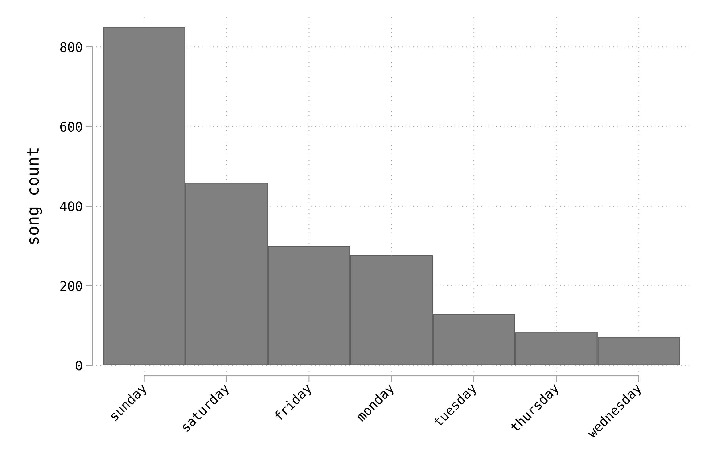

# The Most Musical Day of the Week

Which day of the week is the most emotionally inspiring for musicians? Going in to this I was pretty sure the answer was Sunday, and indeed Sunday is the most popular. Here is the ranking, using the scraped Spotify data from 1.2m songs here: https://www.kaggle.com/rodolfofigueroa/spotify-12m-songs 

I have no idea how the data collector sampled spotify to get these data, so there could be a lot of selection in principle.

